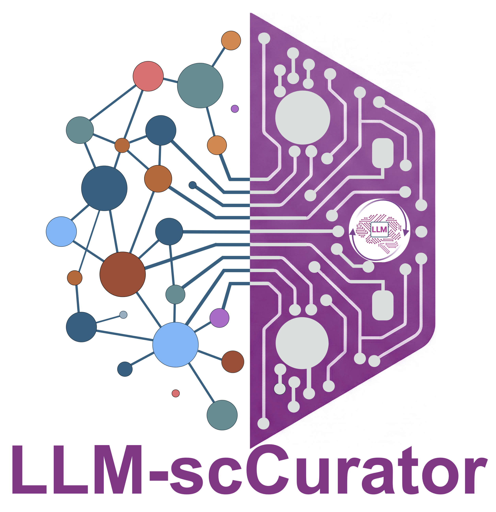

# LLM-scCurator

  

LLM-scCurator is a Python framework for **noise-aware marker distillation** that improves the robustness of **zero-shot cell-type annotation with LLMs** for single-cell and spatial transcriptomics.

## Why it helps
- **Stabilizes inputs**: masks clonotype / housekeeping / stress programs and avoids “garbage-in” marker lists.
- **Preserves biology**: rescues informative lineage-restricted markers and enforces cross-lineage specificity.
- **Scales to discovery**: supports hierarchical coarse-to-fine annotation across scRNA-seq and spatial modalities.

## Links
- GitHub: https://github.com/kenflab/LLM-scCurator
- Getting started: `Getting started`
- Concepts → masking, rescue, leakage filter, hierarchical inference
- API reference: `API reference`

## Privacy
By default, LLM-scCurator operates on locally computed marker summaries. If you use an external LLM API, only compact, cluster-level inputs are sent (no raw matrices).
